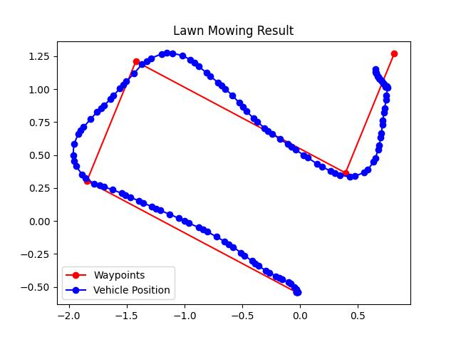

# UnderwaterStitch
This Repo is for Image Stitching for Underwater Development Project in Rovostech. The project has 2 main development path: Image Stitching and ROV Guidance

Clone the code from this directory for usage.
``` terminal
git clone https://github.com/Rovo-3/UnderwaterStitch
```

## Directory Tree:

Image Stitching program is in the masterScript folder.

ROV Guidance and Control program is in the src folder.
```
├───feasibility_study
│   ├───Bagas
│   │   └───myScript
│   │       ├───imgEnhance
│   │       └───Trials
│   └───Jason
│       └───image_stitching
└───src
    ├───image_stitching
    └───lawn_mowing_movement
        └───simulation_and_playground
```
## Image Stitching
Image Stitching code could be found in `image_stitching` folder.

Navigate to [image_stitching](./src/image_stitching/), and run the code : 
```
py main.py
```
Customization 
```
main.py
Line
├─89      method      --> "bf" or "knn"
├─90      ordered     --> "True" if images are manually ordered or "False" 
├─94      sc.seamless --> "True" if needed feathering or "False"
└─98      path        --> "path to images"
```

## Stitch Result


## ROV Guidance and Control
ROV Guidance could be found in the src/lawn_mowing_movement

Overall, the lawn mowing movement consist of 5 main code:
1. Control PID Code [(control.py)](./src/lawn_mowing_movement/control.py)

2. Waypoint Maker for Lawn Mowing [(waypoint_generator.py)](./src/lawn_mowing_movement/waypoint_generator.py)

3. Guidance Code (LOS, PP and Stanley) [(guidance.py)](./src/lawn_mowing_movement/guidance.py)

4. Data Acquisition [(get_data_real.py)](./src/lawn_mowing_movement/get_data_real.py)

5. Main Program to Compile Control, WP, and Guidance [(main.py)](./src/lawn_mowing_movement/main.py)

Settings and datas are stored in JSON file
- PID_parameter.json

    Storing PID parameter and setpoint for tuning purpose

- sensor_data.json

    Store data from Data Acquisition so that Main Program can know the location and status of ROV


To run the code, navigate to [lawn_mowing_movement directory](./src/lawn_mowing_movement/), run the start.bat file

```console
.\start.bat
```
It will automatically run the main program and the data acquisition program.

Example of LM movement:



### Future Development:

1. Optimize the transformation of the coordinates.
2. Create self coordinates based on DVL velocity if option 1 is not visible.
3. Add ability to control altitude.
4. Add feature to enables assist in attitude control. (Currently, joystick must be detached)
5. Optimize image projection
6. Faster ordered image processing (GPU)